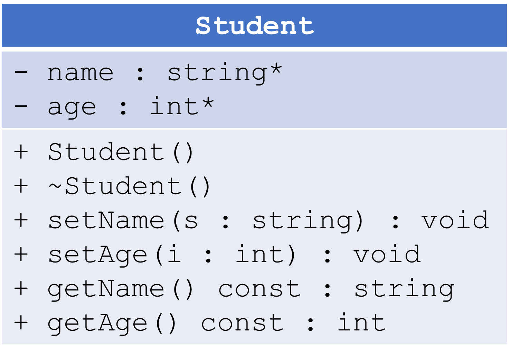

[](https://classroom.github.com/a/4Aola08h)
[](https://classroom.github.com/online_ide?assignment_repo_id=20161326&assignment_repo_type=AssignmentRepo)
# Lab 1, Part B

## Directions

Using class separation, implement a `Student` class according to the following UML diagram:



The implementation details should be straightforward. For the constructor, make it display the message *Student object created!*. For the destructor, make it display the message *Student object destroyed!*.

## Sample Run

The following is a sample run of my solution. You can use this as a model to aim for with your program.

```
Student object created!
Student object created!
Student object created!
Student object created!
Student object created!
Enter the name for student #1: Patricia Perez
Enter the age for student #1: 29
Enter the name for student #2: Carmen
Enter the age for student #2: 23
Enter the name for student #3: Albert DeLeon
Enter the age for student #3: 16
Enter the name for student #4: Brandon W Perry
Enter the age for student #4: 54
Enter the name for student #5: Nicole Henderson
Enter the age for student #5: 30
Student #1
    Name: Patricia Perez
    Age: 29

Student #2
    Name: Carmen
    Age: 23

Student #3
    Name: Albert DeLeon
    Age: 18

Student #4
    Name: Brandon W Perry
    Age: 50

Student #5
    Name: Nicole Henderson
    Age: 30

Student object destroyed!
Student object destroyed!
Student object destroyed!
Student object destroyed!
Student object destroyed!
```
